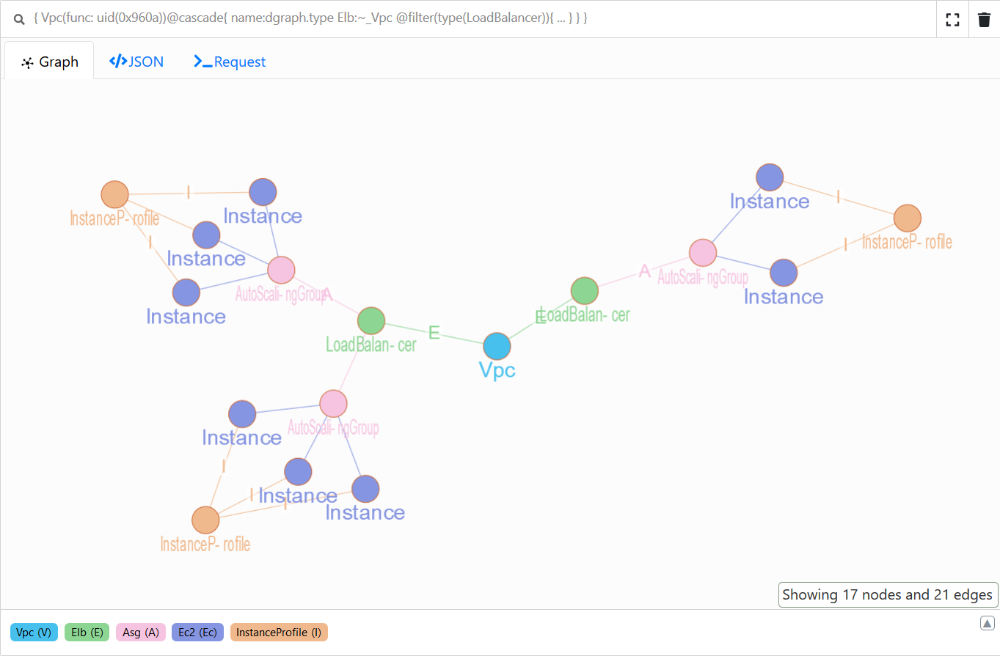
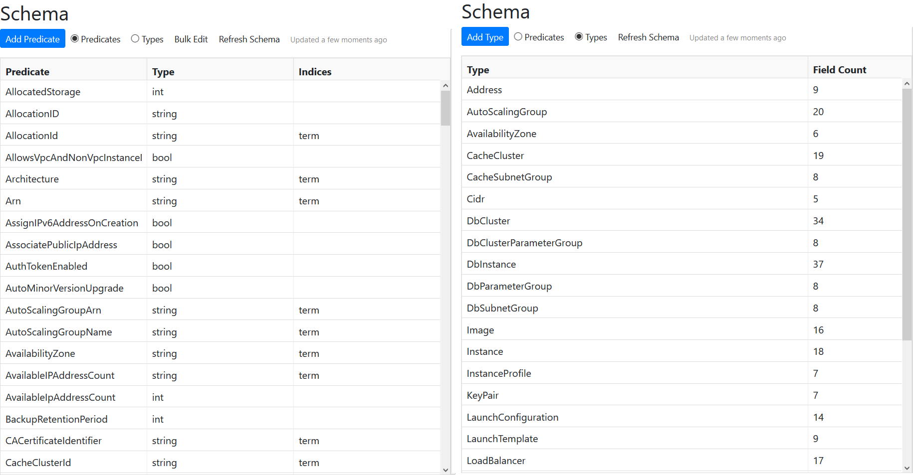

# Description

   

Explore your AWS platform with, [`Dgraph`](https://dgraph.io/), a graph database.



Thanks to Go and its goroutines, we can insert thousand of ressources in few seconds.

## Prerequisites

- [docker](https://docs.docker.com/)
- [docker-compose](https://docs.docker.com/compose/install/)
- [Go](https://golang.org/) (for build only)

## Install

Download and move to `/usr/local/bin/` a binary from [release page](https://github.com/claranet/aws-inventory-graph/releases)

## Build

This project uses *go.mod*, so after cloning this repo, simply run :

```bash
go build && chmod +x ./aws-inventory-graph
```

or

```bash
GOBIN=/usr/local/bin/ go install && chmod +x /usr/local/bin/aws-inventory-graph
```

## Usage

### Start Dgraph server

```bash
make
```

or

```bash
make up
```

Access to WebUI (**dgraph-ratel**) : [http://localhost:8000](http://localhost:8000)

### Import ressources

Authentication is based on your `.aws/config` file.

```bash
Usage of aws-inventory-graph:
  -dgraph string
        Dgraph server (ip:port) (default "127.0.0.1:9080")
  -drop
        Drop all nodes and the schema
  -list
        List available ressource types
  -no-schema
        Disable the refresh schema at each run
  -profile string
        Profile from ~/.aws/config (default "default")
  -region string
        AWS Region (default "eu-west-1")
  -type string
        Get the schema for a type (only after importing some data)
```

Example :

```bash
aws-inventory-graph -region us-west-2 -profile xxxx

2019/11/29 17:35:58 Drop all previous data
2019/11/29 17:35:58 Add schema
2019/11/29 17:36:04 List ...
...
2019/11/29 17:36:05 Add ... Nodes
...
2019/11/29 17:36:08 Add ... Edges
...
```

### Get schema for a type

You can get all schemas for *types* and *predicates* in **dgraph-ratel** WebUI:



or with binary, in JSON format :

```bash
aws-inventory-graph -type Address | jq

{
  "types": [
    {
      "fields": [
        {
          "name": "name",
          "type": "string"
        },
        {
          "name": "Service",
          "type": "string"
        },
        {
          "name": "Region",
          "type": "string"
        },
        {
          "name": "OwnerId",
          "type": "string"
        },
        {
          "name": "PrivateIpAddress",
          "type": "string"
        },
        {
          "name": "PublicIp",
          "type": "string"
        },
        {
          "name": "Domain",
          "type": "string"
        },
        {
          "name": "AllocationId",
          "type": "string"
        },
        {
          "name": "_Instance",
          "type": "Instance"
        }
      ],
      "name": "Address"
    }
  ]
}
```

**Predicates which are prefixed with a `_` are Edges, and they all have a reverse.**

## Stop and/or Remove Dgraph

Stop :

```bash
make stop
```

Remove :

```bash
make rm
```

## Available Ressources

Here the list of currently supported ressources :

- Address
- AutoScalingGroup
- AvailabilityZone
- CacheCluster
- CacheSubnetGroup
- Cidr
- DbCluster
- DbClusterParameterGroup
- DbInstance
- DbParameterGroup
- DbSubnetGroup
- Instance
- InstanceProfile
- KeyPair
- LaunchConfiguration
- LaunchTemplate
- LoadBalancer
- NatGateway
- OptionGroup
- SecurityGroup
- Subnet
- TargetGroup
- Volume
- Vpc
- VpcPeeringConnection

**All Edges between the Nodes have reversed.**

:warning: AWS API is often messy, names are not consistent from one endpoint to another, we try to fix that and keep a global coherance. This is why some Predicates don't match exact names returned by API.

## Query examples

See [here](https://docs.dgraph.io/query-language/) to get more info about **Dgraph’s GraphQL+**.

### Get Elastic IPs + Instances + NatGateways

```bash
{
  Address(func: type(Address)) @filter(has(_Instance) or has(_NatGateway)){
    name dgraph.type PublicIp
    Instance:_Instance {name dgraph.type InstanceId}
    NatGateway: _NatGateway{name dgraph.type NatGatewayID}
  }
}
```

### Get Classic LoadBalancers + AutoScalingGroups + Instances

```bash
{
  LoadBalancer(func: type(LoadBalancer))@filter(eq(LoadBalancerType, classic)) @cascade{
    name dgraph.type
    AutoScaling:~_LoadBalancer {
        name dgraph.type
        Instance:_Instance{
            name dgraph.type InstanceId
        }
    }
  }
}
```

### Get Application LoadBalancers + TargetGroups + AutoScalingGroups + Instances

```bash
{
  LoadBalancerV2(func: type(LoadBalancer))@filter(eq(LoadBalancerType, application))@cascade{
    name dgraph.type
    TargetGroup:~_LoadBalancer @filter(type(TargetGroup)){
        name dgraph.type
        AutoScalingGroup:~_TargetGroup @filter(type(AutoScalingGroup)){
            name dgraph.type Instance:_Instance{
                name dgraph.type InstanceId
            }
        }
    }
  }
}
```

### Get VpcPeeringConnections + Vpcs

```bash
{
  VpcPeeringConnection(func: type(VpcPeeringConnection)){
    name dgraph.type VpcPeeringConnectionId
    AccepterVpc:_AccepterVpc {name dgraph.type VpcId}
    RequesterVpc:_RequesterVpc {name dgraph.type VpcId}
  }
}
```

### Get which Instances have access to which DbInstances

```bash
{
  DbInstances(func: type(DbInstance))@cascade{
    name dgraph.type
    SecurityGroup:_SecurityGroup {
      name dgraph.type GroupId
      IngressSecurityGroup:_SecurityGroup @facets {
        name dgraph.type
        Instance:~_SecurityGroup @filter(type(Instance)){
          name dgraph.type InstanceId
        }
      }
    }
  }
}
```

### Get the Cidr which are allowed for access to DbInstances

```bash
{
  Rds(func: type(DbInstance))@cascade{
    name dgraph.type
    SecurityGroup:_SecurityGroup {
      name dgraph.type GroupId
      IngressCidr:_Cidr @facets {
        name dgraph.type
      }
    }
  }
}
```

### Get Instance opened worldwide + associated ports

```bash
{
  OpenWorldCidr(func: eq(name, "0.0.0.0/0"))@cascade{
    name dgraph.type
    SecurityGroup:~_Cidr @filter(type(SecurityGroup)) @facets {
      name dgraph.type GroupId
      Instance:~_SecurityGroup @filter(type(Instance)){
        name dgraph.type InstanceId
      }
    }
  }
}
```

### Get which KeyPairs give access to which Instances

```bash
{
  KeyPair(func: type(KeyPair))@cascade{
    name dgraph.type
    Instance:~_KeyName{
      name dgraph.type InstanceId
    }
  }
}
```

### Get CacheClusters (Elasticache) with Instances which have access to them

```bash
{
  Memcached(func: type(CacheCluster))@filter(eq(Engine, memcached))@cascade{
    name dgraph.type
    SecurityGroup:_SecurityGroup @facets {
      name dgraph.type
      IngressSecurityGroup:_SecurityGroup @facets {
        name dgraph.type
        Instance:~_SecurityGroup @filter(type(Instance)){
          name dgraph.type InstanceId
        }
      }
    }
  }
  Redis(func: type(CacheCluster))@filter(eq(Engine, redis))@cascade{
    name dgraph.type
    SecurityGroup:_SecurityGroup @facets {
      name dgraph.type
      IngressSecurityGroup:_SecurityGroup @facets {
        name dgraph.type
        Instance:~_SecurityGroup @filter(type(Instance)){
          name dgraph.type InstanceId
        }
      }
    }
  }
}
```

### Get InstanceProfiles which are not used by Instances

```bash
{
  InstanceProfile(func: type(InstanceProfile)) @filter(not has(~_InstanceProfile)) {
    name dgraph.type
  }
}
```

## Author

Thomas Labarussias ([@Issif](https://github.com/Issif))
